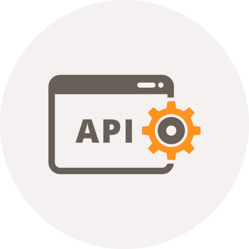

<div align="center">

</div>

# Blazor.MinimalApi


[](https://github.com/naice/Blazor.MinimalApi/actions/workflows/release.yml)

This project aims to simplify Blazor Api Data requests and get rid of messy url definitions.


## Blazor.MinimalApi.Server
[](https://www.nuget.org/packages/Blazor.MinimalApi.Server/)

### Download & Install
**Nuget Package [Blazor.MinimalApi.Server](https://www.nuget.org/packages/Blazor.MinimalApi.Server/)**

```powershell
Install-Package Blazor.MinimalApi.Server
```
### Program.cs
```csharp 
// Add endpoint definitions
builder.Services.AddEndpointDefinitions(typeof(Program));

var app = builder.Build();
// ...
app.UseEndpointDefinitions();
```
### SampleEndpointDefinition.cs
```csharp 
public class SampleEndpointDefinition : IEndpointDefinition
{
    public void DefineEndpoints(IEndpointRouteBuilder builder)
    {
        builder.MinimalMapGet<Car[]>(async ([FromQuery(Name = "count")] int count) =>
        {
            await Task.Delay(100);
            return new CarFaker().Generate(count);
        });
        builder.MinimalMapGet<CarsRequest, Car[]>((CarsRequest request) 
            => new CarFaker().Generate(request.Count));
        builder.MinimalMapQuery<CarsRequest, Car[]>((CarsRequest request) 
            => new CarFaker().Generate(request.Count));
    }
}
```
## Blazor.MinimalApi.Client
[](https://www.nuget.org/packages/Blazor.MinimalApi.Client/)

### Download & Install
**Nuget Package [Blazor.MinimalApi.Client](https://www.nuget.org/packages/Blazor.MinimalApi.Client/)**

```powershell
Install-Package Blazor.MinimalApi.Client
```
### Program.cs
```csharp 
// Add minimal api client
builder.Services.AddMinimalApiClient();
```
### CarsRequestSample.razor
```csharp 
@page "/"
@using Blazor.MinimalApi.Model
@inject MinimalHttpClient<CarsRequest, Car[]> CarClient

<PageTitle>MinimalHttpClient&lt;CarsRequest, Car[]&gt; Sample</PageTitle>

<input type="number" @bind="_countCars" />
<input type="button" value="Load Cars" @onclick="LoadCars"/>   

<h1>Cars</h1>

@foreach (var car in _cars.OrderBy(c => c.Manufacturer))
{
    <div>
        <h4> @car.Manufacturer - @car.Model </h4>
        <strong>@car.Type</strong> - @car.Fuel<br/>
        <i>@car.Vin</i><br/>
        <hr/>
    </div>
}

@code{
    private int _countCars = 10;
    private Car[] _cars = Array.Empty<Car>();

    private async Task LoadCars()
    {
        _cars = await CarClient.Query(new CarsRequest(_countCars)) ?? Array.Empty<Car>();
    }
}
```
## Blazor.MinimalApi.Abstractions
[](https://www.nuget.org/packages/Blazor.MinimalApi.Abstractions/)

### Download & Install
**Nuget Package [Blazor.MinimalApi.Abstractions](https://www.nuget.org/packages/Blazor.MinimalApi.Abstractions/)**

```powershell
Install-Package Blazor.MinimalApi.Client
```

### Info
Main reason for the abstraction library is the `IMinimalApiRouteProvider` 
interface and it's default implementation `MinimalApiDefaultRouteProvider`. 
This interface is shared Client / Server side and used to build routes.
